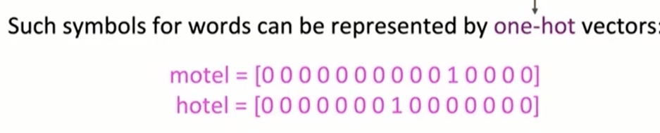
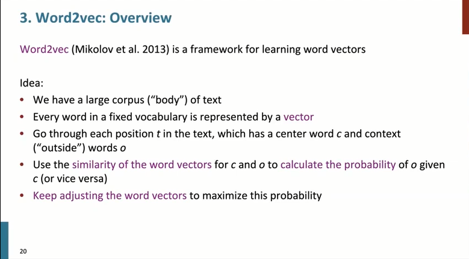
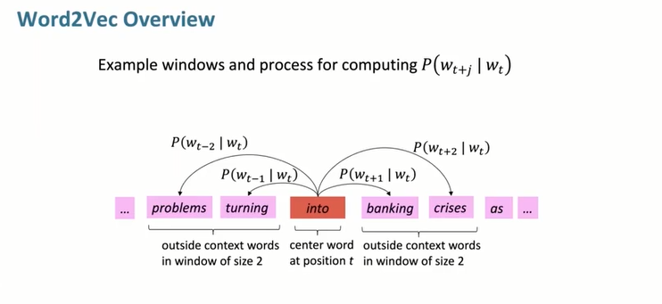

# Lecture1 Introduction of NLP & Word Vectors
##
##
## WordNet
### 基本概念
+ **A common NLP solution.**
+ A thesaurus(同义词词典) containing lists of **synonym sets** and **hypernyms**("is a" relationships，上义词)
  + 不同种词性的“同义词”good-honorable（adj）、good-goodness（noun）
  + 给出一个词就能给出其上义词，比如panda的上义词mammal、object、living_thing等等
### 缺陷
+ WordNet:Great as resource but missing nuance(细微差别)
  + "prificient" 是 “good” 的同义词
  + 但是仅在某些上下文中才成立
+ 对于新兴含义难以做到keep up-to-date
+ Subjective, 非常主观
+ 不能准确地定量研究文字的“相似性”
## 传统机器学习的问题
+ 词被表达为discrete symbols
+ 具体来说每个词汇被表达成One-hot向量
+ 
+ One-hot表达法的问题在于：
  + 任意两个向量均Orthogonal（正交）
  + 任意两个one-hot向量之间没有“自然相似性”或者“联系”
  + 比如进行Hotel和Motel的联想在WordNet中是无意义的
## 利用上下文表达word
### Distributional semantics（分布式语义）
+ 一个词的含义由经常出现在它它附近的词来定义。
> "You shall know a word by the company it keeps"(J.R. Firth 1957:11)
+ **上下文**：对于一个词语$w$的上下文具体定义为$w$周围固定大小的窗口范围内的词。
+ 使用$w$很多的上下文去表达$w$的具体语义。

+ 这是个非常有哲学意义的见解，一个词的语义可以从经常和它一起出现的上下文情况得到推断。
+ 此方法具有极其良好的可计算性，这使其可以非常有效的应用于深度学习中。
## Word Vectors
+ 我们希望为每个词汇建立“密集实数向量”，使其可以表达那个词的意义，其手段在于预测该词汇上下文出现其他词的可能性。
+ 这个向量维度很大，常见的是300维
+ 对于每个词都有具体的word vector表达它
+ 也有如下称谓：
  + word embeddings
  + (neural) word representations
+ 这是一种“distributed representation”（而不是localed），因为一个词的含义被分散到300个向量上
+ 即便经过降维到2维平面Visualization后，这样的表达方式也能呈现出一定程度的聚类。示例中“国家”都是在一团，“is am are were was”在一团（虽然仅仅是3维降2维就已经损失大部分信息了）
## 具体算法：Word2vec （2013 Mikolov et al.2013)
+ 此方法是学习词向量的框架

+ 要根据当前的中心词不断校正实际出现的中心词的上下文的概率

+ 上图是实现了窗口为2的计算
+ 需要进行一些计算以实现这个过程
### objective funtion（cost / loss function）
+ 对于每一个位置$t=1,...,T$，T是单词的个数。预测在大小为$m$的视窗内的中心词的$w_j$的数据Likelihood为：

$$Liklihood=L(\theta)=\prod_{t=1}^T\prod_{-m\le j\le m,j\neq0}P(w_{t+j}|w_t;\theta)$$ 

其中$\theta$是所有的待优化变量

+ 对于具体的Cost function来说，使用平均负对数似然进行表达
$$J(\theta)=-\frac{1}{T}\log L(\theta)$$

+ 没有原因，只是希望最小化我们的目标函数$J(\theta)$所以贴了一个负号
+ 此时得到一个优化问题
$$Minimizing\ objective\ funtion\leftrightarrow Maximizing\ predictive\ accuracy$$
### 如何解优化问题
$$P(w_{t+j}|w_t;\theta)=?$$
+ 解决方案：
  + 对于每个word用两个向量进行表达：
    + $v_w$是用于中心词
    + $u_w$是用于上下文  
  + 此时对于中心词$c$和上下文词$o$：
    + $$P(o|c)=\frac{\exp(u_o^Tv_c)}{\sum_{w\in V}\exp(u_w^Tv_c)}$$
    + 